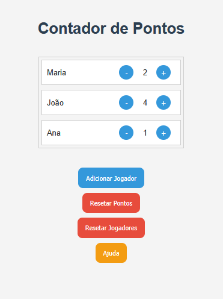

# Contador de Pontos

[](https://developer.mozilla.org/en-US/docs/Web/JavaScript)


Um projeto simples para contagem de pontos, ideal para jogos, competições ou qualquer situação que exija acompanhamento de pontuação.

## Funcionalidades

- Adicionar e remover pontos
- Resetar pontuação e jogadores
- Interface intuitiva

## Instalação

1. Clone o repositório:
  ```bash
  git clone https://github.com/julianebueno/Contador-de-Pontos.git
  ```
2. Navegue até a pasta do projeto:
  ```bash
  cd Contador-de-Pontos
  ```
3. Abra o index.html no navegador.

## Previews



---
Feito por Juliane Bueno
